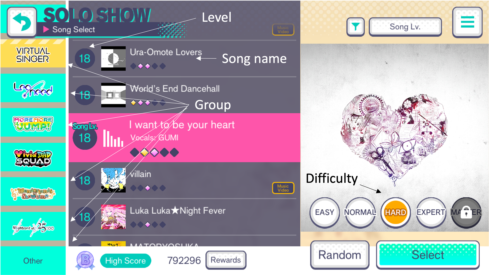
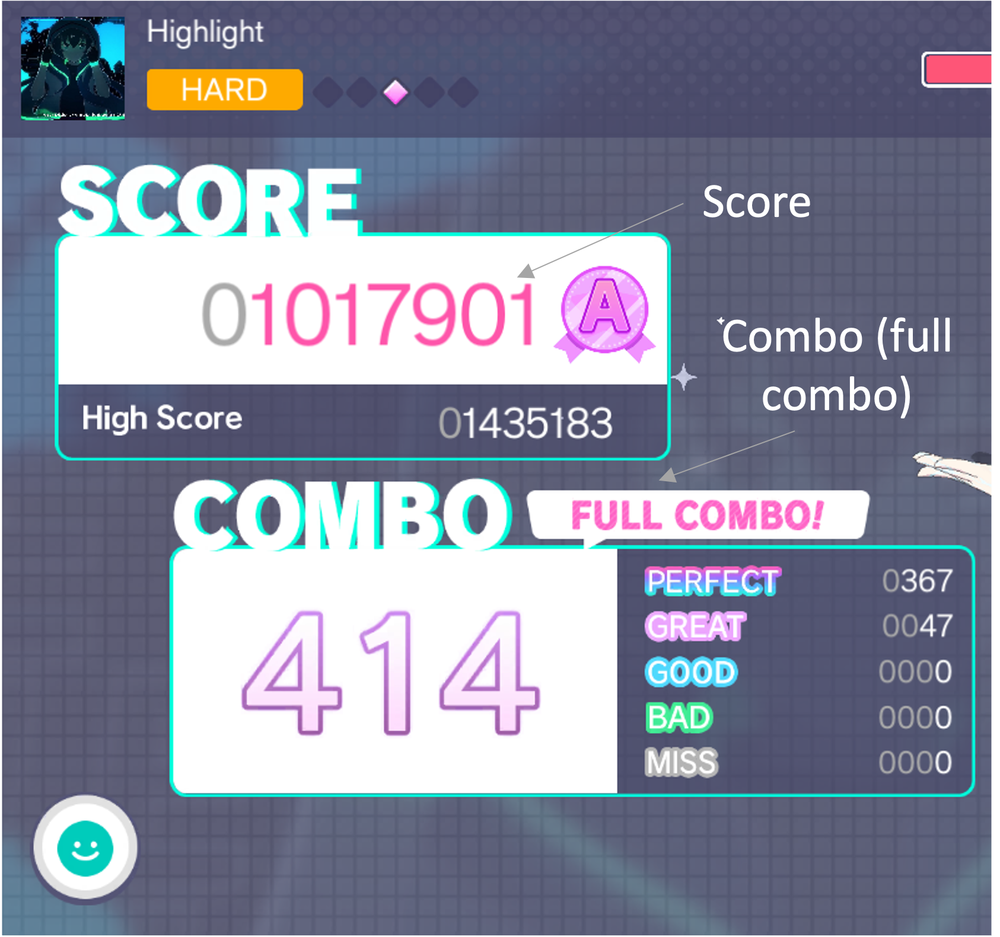

# Hatsune Miku Project Sekai: Colorful Stage Score Tracker
API v. 1.1.1 (April 2023)
- Known bugs: Output may render incorrect combo status (Fixed)

## Patch Notes: 
- v. 1.1.1
    - Added additional validation using AJV Schema. Sorry pranksters and amateur web devs!
- v. 1.0.1
    - Hotfixed issues with the forms
    - Combo Status bug should be squashed

***Check out the project [here](https://two600-jchan211final.onrender.com/)!***

## Table of Contents:

- [What is Hatsune Miku Project Sekai: Colorful Stage?](#what-is-hatsune-miku-project-sekai:-colorful-stage?)
- [What is the Hatsune Miku Project Sekai: Colorful Stage Score Tracker?](what-is-the-hatsune-miku-project-sekai:-colorful-stage-score-tracker?)
- [API Features](#api-features)
- [Using the API Endpoints](#using-the-api-endpoints)
    - [Posting a Song](posting-a-song)
    - [Searching for a Song](Searching-for-a-song)
    - [Posting a Round](posting-a-round)
    - [Searching for a Round](searching-for-a-round)
- [Reccomendations for Integrating the API](#reccomendations-for-integrating-the-api)
- [Acknowledgements](#acknowledgements)


## What is Hatsune Miku Project Sekai: Colorful Stage?

Hatsune Miku Project Sekai: Colorful Stage is a rhythmn game developed by SEGA, Craft Egg, Colorful Palette and Crypton Future media. It takes place in a fictional Tokyo, Japan and features new original characters and familiar Vocaloid characters.  

**Links:**  
- [Official Site (Japanese)](https://pjsekai.sega.jp/)
- [Official Twitter (Japanese)](https://twitter.com/pj_sekai)
- [Official YouTube (Japanese)](https://www.youtube.com/channel/UCdMGYXL38w6htx6Yf9YJa-w?view_as=subscriber)
- [Official English Twitter](https://twitter.com/ColorfulStageEN)
- [Official English Site](https://www.colorfulstage.com/)
- [Official English YouTube](https://www.youtube.com/@HATSUNEMIKUCOLORFULSTAGE/videos)

## What is the Hatsune Miku Project Sekai: Colorful Stage Score Tracker?
The Hatsune Miku Project Sekai: Colorful Stage Score Tracker is designed to provide a way to save songs that you like and the scores from each round you play. You can then access previous scores and see how you improved (or got worse). 

## API Features
- Saving songs: You can save songs that you like by using the song's name and the name of the group that sings it.   
- Saving individual rounds: You can save an individual round, and, using its song name, it can be associated with an existing song in the database! You can also save data about its difficulty, level, score, whether or not you got a full combo, any additional comments you want to leave.     
- Searching for Song: You can search by name, and/ or whether or not you got a full combo on it.   

- Searching for a round: Similar to searching for a song, you can find rounds for an individual song, and/ or whether you got a full combo on it.  



## Using the API Endpoints 
The following are the endpoints for making HTTP POST and GET requests. As mentioned before, you can get songs and rounds by name or by whether or not you got a full combo. GET requests use the request query, and POST requests use the request body.

### Posting a Song:  
Endpoint:   
`POST /api/v1/songs`
- You can make requests using the body, which should match the following format:
```
{
    name:"Name of song here",
    group:"Name of Group here"
}
```
Note that the group property uses the shortened version of the in-game group names.  
| In-game Group Name  | Abbreviation |
| ------------- |:-------------:|
| Leo/Need      | L/N     |
| More More Jump!      | MMJ     |
| Vivid Bad Squad      | VBS     |
| Wonderland x Showtime | WXS |
| Nightcord at 25:00 | N25 |
| Virtual Singer | VS |
| Other | other |  

 For more information about groups see [here](https://projectsekai.fandom.com/wiki/Category:Characters).
If the save was successful the following is sent as confirmation:
```
{
  name: 'Charles',
  group: 'N25',
  rounds: [],
  _id: new ObjectId("6434f630ea0235e49aeebf68"),
  __v: 0
}
```
### Searching for a Song
Endpoint:  
`GET /api/v1/songs/?name={nameOfSong}&combo={false}`
- GET requests are made using the request query
    - name: Name of the song. Make sure that spaces are properly encoded in the URL
    - combo: Whether or not to search for songs with a full-combo. This should be either `"true"` or `"false"`. It should be true if you're looking for songs with a full combo and false for songs without a full combo. 
The result will be the song that matches the parameters, as seen below:
```
{
    group:"VS",
    name:"Servant of Evil",
    rounds:[],
    __v:0,
    _id:"642fe275b8ec4caa7d251126"
}
```
    
### Posting a Round
Endpoint: `POST /api/v1/rounds/`  
- Similar to making POST requests for songs, POST requests for rounds should use the request body and have the following format: 
```
{
    songName:"Cutlery",
    difficulty:"hard",
    level:19,
    score:12345435,
    fullCombo:"false",
    comments:"Expected output."
}
```
Unlike the POST request for a song, some of the attributes other than String. Refer to this table for accepted types.
| Attribute  | Type |
| ------------- |:-------------:|
| songName      | String     |
| difficulty      | enum of Strings: ["easy", "normal", "hard", "expert", "master"]     |
| level      | number     |
| score | number |
| fullCombo | String |
| comments | String |  

    There is also an additional `date` property added by the API when the document is created. 
The result should be sent back and will look something like this:
The original object that was sent should be sent back as confirmation of a successful save. It should like this:
```
 {
  songName: 'Cutlery',
  difficulty: 'hard',
  level: 19,
  score: 12345435,
  fullCombo: false,
  comments: 'Expected output',
  dateEntered: 2023-04-11T01:16:19.546Z,
  _id: new ObjectId("6434b4e3ee960ea10cb30450")
}
```
Any errors are sent back in an array like so:
```
[
  {
    instancePath: '',
    schemaPath: '#/errorMessage',
    keyword: 'errorMessage',
    params: { errors: [Array] },
    message: 'Please ensure that you entered a level.'
  }
]
```
### Searching for a Round
Endpoint:
`GET /api/v1/rounds/?songName="Senbonzakura"&fullCombo="true"
- Like the GET Request for a song, the GET request for rounds also uses the request query. It has the following properties:
    - songName: Name of the song. Make sure that spaces are properly encoded in the URL
    - fullCombo: Whether or not to search for songs with a full-combo. This should be either `"true"` or `"false"`. It should be true if you're looking for songs with a full combo and false for songs without a full combo. 
The expected result should be an array of Rounds. An element of this array may look like this: 
```
{
    songName: 'Senbonzakura',
    difficulty: 'hard',
    level: 20,
    score: 1231234134,
    fullCombo: true,
    comments: 'fasdfas',
    dateEntered: 2023-04-07T09:56:03.802Z,
    _id: new ObjectId("642fe8b3ece7da2e4302be49")
}
```

## Reccomendations for Integrating the API
- If you're pulling from this repository, the API logic is contained in the `controllers` folder. All of the front end logic is contained in `src`.
- You will require your own database connection. This web app was developed using MongoDB as its database. 
- Any error messages are stored in the `message` field of each element of the error array. 

## Acknowledgements
- Thank you to Jordan Miller for providing resources and tutorials on Express, AJV, Mongo/Mongoose, and React in order to develop this project.
- Thank you as well to MDN Web Docs, W3 Schools, Mongoose, React.dev for additional resources regrading HTML forms and input, CSS techniques, database operations, and additional React techniques.
   
     
  ________   
  This project is entirely fanmade, and has no association with SEGA, Craft Egg, Colorful Palette or Crypton Future Media. All screenshots are taken from in-game, and belong to their respective copyright holders.
